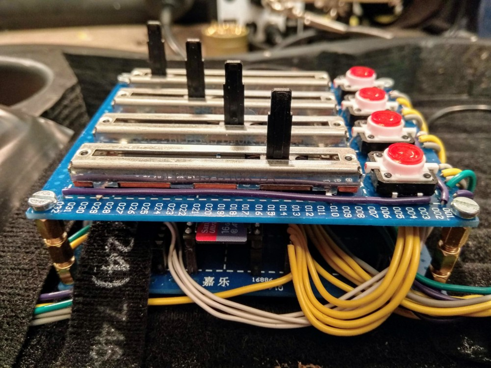

# kxmx_ruitar

A guitar shaped MIDI/OSC instrument

## The Idea

The goal of this project is pretty simple; Take the general functionality of your typical MIDI keyboard or control surface and implement it (robustly, and with low latency) in the form factor of a guitar.  The motivation is a a little less straightforward. Three things:

1. I wanted to wear it on stage while maintaining the freedom to move about.  
1. I wanted to make it myself.
1. It didn't want to spend a fortune.

This is what I came up with:

I like the form factor of a guitar because it can look quite traditional in a rock band context, but upon closer inspection is clearly not.  This reflects my taste in music, superficially recognizable, but substatially deviant.  While I can play the guitar, I didn't feel it necessary that a functional guitar be augmented with MIDI controller capabilities, primarially because my single-threaded brain just cannot effectively handle playing an instrument well, while controlling other parameters. 

The DIY approach is simply an excuse to get lost in the details of interesting technical challenges instead of practicing, or composing actual music. 

Regarding limiting cost... Yeah, anyone who has ever attempted a DIY project like this knows it's actually BS. There is no competing with the economies of scale that a market product has. We DIYers like to trick ourselves by spreading the costs into tiny chunks, over many months. But, I consider the premium an investment in enjoyment and the knowledge gained along the way. So that's how it ended up here.  

The project is split into two sections, body and head.

## [The Body](https://github.com/recursinging/kxmx_ruitar/tree/master/ruitar-body)

The ruitar-body is the core of the instrument, effectively a variety of sensors attached to a microcontroller (a [Teensy 3.6](https://www.pjrc.com/store/teensy36.html)) which converts the sensor data into MIDI and OSC messages. The following sensors are implemented and working:

* 4 500mm [ThinPot](http://www.spectrasymbol.com/product/thinpot/) Membrane Potentiometers (Strings)

* 4 38x38mm [FSR](https://www.interlinkelectronics.com/fsr-406) Pressure Sensors (Pads)
* 1 [Joystick](https://www.adafruit.com/product/444)

* 4 45mm [Slider Potentiometers](https://www.digikey.com/product-detail/en/tt-electronics-bi/PS45-21PC3BR10K/987-1409-ND/2620678) (Faders)
* 4 [LED Buttons](https://www.sparkfun.com/products/10442) (Toggles)

These sensors are sampled via the microcontroller ADCs, the values are calculated and, if appropriate, MIDI and OSC messages are sent out. (currently via USB to a PC).

The logic controlling when and what messages to send is configurable by a INI style text files on an SD card. These files can be considered "Presets" and can be copied, modified, renamed, and saved to the SD card.  

There is an SSD1306 64x32 OLED display mounted to the body of the guitar.  

I had plans to make presets configurable through this display, but I found the OSC GUI much easier and more powerful, so this display is currently relegated to display some basic debugging info at the moment.  Perhaps there is a better use for it, or the SPI pins it is occupying?

Presets can also be edited via OSC using [the GUI definition](https://github.com/recursinging/kxmx_ruitar/blob/master/osc-gui.json) for [Open Stage Control](https://osc.ammd.net/)

The default configuration is for it to behave a bit like a real guitar. Pressing a position on a "string" (0-3) determines the pitch of the note, while triggering the note on state, and its velocity is determined by pressure detected at the associated (0-3) "pad".  The faders, and toggles emit CC messages, and the joystick can emit CC and pitch bend messages. Sensor values recieved from the head (accellerometer, encoders) can also be configured to emit MIDI CC messages.

## [The Head](https://github.com/recursinging/kxmx_ruitar/tree/master/ruitar-head)

The ruitar-head is set of sensors attached to a microcontroller ([Teensy LC](https://www.pjrc.com/teensy/teensyLC.html)) acting as an I²C slave device.  It is attached to the headstock of a guitar. I've connected it to the body module with wires pulled through the neck of the guitar.  I removed all the tuning hardware and screwed it directly to the headstock.

The head contains:

* 4 [RGB LED Rotary Encoders]() (Knobs)
* 1 [3 Axis Accellerometer]() (Accel)

The firmware provides a set of read-only registers which can be read to obtain the accelerometer, and encoder values.  Additionally the state of the RGB LEDs can be polled and changed by a set of read-write registers.

## TODOs

Things that still need to be done, but are incomplete.

- [ ] Design a PCB for the body
- [ ] Fix broken I²C communication between body and head
- [ ] Implement the OSC GUI parameter config
- [ ] Implement the OSC GUI preset copy/rename/save functions
- [ ] Implement a useful MIDI emitter for the accelerometer data
- [ ] Provide better descriptions, code comments, build docs, pics, etc

## Feature Ideas

A few ideas I've been batting around:

### Synth! 

The Teensy 3.6 is laughing at the current workload.  There is plenty of capacity to implement a digital synth, and the Teensy Audio library is amazing.  I've already started this, but ran into a couple of problems.  I'd like to make this happen if I find the time.

### Ethernet (or WiFi)

At the moment OSC is provided over SLIP encoded Serial. This works, but is a kludge requiring [a bridge program](https://github.com/recursinging/kxmx_trestle) to get the UDP packets that all the OSC clients expect.

There is a Neutrik RJ-45 jack built into the body of the ruitar,  I could provide power over the unused pairs assuming 100-BASE-T.  But without the USB cable I would loose all the USB* devices the Teensy can emulate, which would be a bummer. 

Alternatively I could send the SLIP serial to an ESP32 and broadcast the OSC packets via WiFi? 

### Membrane Potentiometer Alternatives

The kxmx_ruitar is *really* hard to play accurately.  Tracking on the "strings" is not bad, but the lack of any tactile feedback along them makes it difficult to get a position reference. Anyway, since MIDI messages are discrete notes, that means all the position data the pot and ADC could provide gets quantized to 20 values anyway... They might as well be buttons, right?

## Inspiration, Ideas, and Prior Art

Here's a list of products and projects from which I have gathered ideas:

* [Misa Digital Tri-Bass](https://misa-digital.myshopify.com/products/tri-bass)
* [Starr Labs Z-Tars](https://www.starrlabs.com/product/z6s/)
* [Expressiv MIDI Pro](https://www.rorguitars.com/products/expressiv-midi-pro)
* [Alesis Vortex](https://www.alesis.com/products/view2/vortex-wireless-2)
