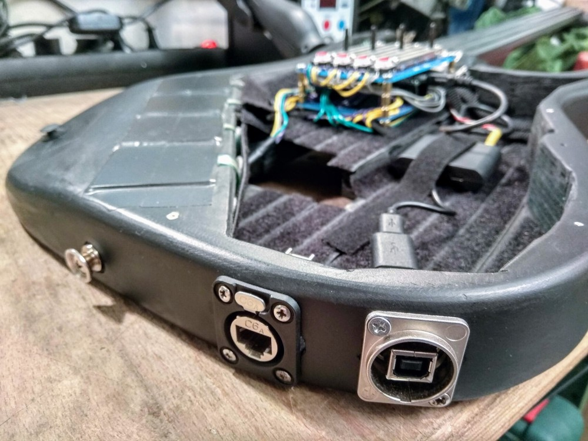

# kxmx_ruitar

A guitar shaped MIDI/OSC instrument

## The Idea

The goal of this project is pretty simple; Take the general functionality of your typical MIDI keyboard or control surface and implement it (robustly, and with low latency) in the form factor of a guitar.  The motivation is a a little less straightforward. Three things:

1. I wanted to wear it on stage while maintaining the freedom to move about.  
1. I wanted to make it myself.
1. It didn't want to spend a fortune.

I like the form factor of a guitar because it can look quite traditional in a rock band context, but upon closer inspection is clearly not.  This reflects my taste in music, superficially recognizable, but substantially deviant.  While I can play the guitar, I didn't feel it necessary that a functional [guitar be augmented](http://lividinstruments.com/products/guitar-wing/) with MIDI controller capabilities, unless the two can be [seamlessly combined](https://www.rorguitars.com/products/expressiv-midi-pro). This is primarily because my single-threaded brain just cannot effectively handle playing an instrument well, while controlling other parameters. 

Because a guitar hangs down in front of you, facing out, visual controls and feedback are pretty useless.  [A touch screen on the front of the guitar](https://misa-digital.myshopify.com/products/tri-bass) for example, is effectively a touch-pad for the player and a light show for the audience. Therefore I am mostly interested in tactile type sensors which can be blindly interacted with.

The DIY approach is simply an excuse to get lost in the details of interesting technical challenges instead of practicing, or composing actual music. 

Regarding limiting cost... Yeah, anyone who has ever attempted a DIY project like this knows it's actually BS. There is no competing with the economies of scale that a market product has. We DIYers like to trick ourselves by spreading the costs into tiny chunks, over many months. But, I consider the premium an investment in enjoyment and the knowledge gained along the way. So that's how it ended up here.  

## The (current) BOM

* 1 [Teensy 3.6](https://www.pjrc.com/store/teensy36.html) with SD card
* 1 Junk electric guitar, or similarly shaped object.
* 4 500mm [ThinPot](http://www.spectrasymbol.com/product/thinpot/) Membrane Potentiometers (Strings)
* 4 38x38mm [FSR](https://www.interlinkelectronics.com/fsr-406) Pressure Sensors (Pads)
* 1 [Joystick](https://www.adafruit.com/product/444)
* 4 45mm [Slider Potentiometers](https://www.digikey.com/product-detail/en/tt-electronics-bi/PS45-21PC3BR10K/987-1409-ND/2620678) (Faders)
* 4 [LED Buttons](https://www.sparkfun.com/products/10442) (Toggles)
* 1 [SSD1306 64x32 OLED display](https://www.adafruit.com/product/326)
* A diverse set of 0805 SMD resistors and capacitors
* Bits and Bobs (proto board, hookup wire, solder, tape, velcro, etc.)

(With Optional Headstock)

* 1 [Teensy LC](https://www.pjrc.com/teensy/teensyLC.html)
* 4 [RGB LED Rotary Encoders](https://www.sparkfun.com/products/10982)
* 1 [ADXL345 3 Axis Accelerometer](https://www.sparkfun.com/datasheets/Sensors/Accelerometer/ADXL345.pdf) (Accel)
* 1 [TLC5940 PWM Controller](http://www.ti.com/lit/ds/symlink/tlc5940.pdf)
* A diverse set of 0805 SMD resistors and capacitors
* [The ruitar-head PCB]()

## The Build

The guitar used was a junk no-name electric.  I hollowed out from the front of the body with an oscillating multi-tool and a wood blade, leaving space for the FSRs.  Because the body is plywood, it was pretty easy to remove the bulk of the material.  I spray-painted everything black and carpeted the inside with adhesive Velcro strips (loop side). This has been quite helpful for cable management and general experimentation.  Just put some hook Velcro to the bottom of a breadboard and stick it in there. Need a USB Hub? Raspberry Pi? Velcro!

The FSRs are attached with some double sided foam tape which holds them solidly in place and gives them a little bit of padding, which is good when you are banging on them with your knuckles.  The little thumb joystick is mounted in the body with hot glue, and wired through a hole bored into the body cavity. The joystick is meant to be moved with the palm of your hand, allowing you to modulate parameters while tapping on the FSRs... In practice, little thumb joysticks like that are junk, they have too little travel to introduce any decent dynamic.  I am actively looking for an alternative, larger joystick with more travel.

The first prototype was done using breadboards and an Arduino Mega2650 clone.  When it was finally functional, I found the latency to be unacceptable, the breadboard connections were fragile and problematic,and I also found it lacking interface components.  So, I swapped the Mega2650 for a Teensy 3.6, soldered all the connections using some protoboard, and added the four faders plus four LED buttons. The result is this new prototype module. I'm designing a PCB which will replace this.

There are USB-A and RJ-45 jacks to the side using some nice, locking Neutrik jacks.  Because the Teensy's advanced USB capabilities, there is only USB IO at the moment.  The unused RJ-45 is for some future ideas.

There is an SSD1306 64x32 OLED display mounted to the side of the body of the guitar. I simply flattened a little part of the edge with a belt sander, and drilled a hole into the body cavity for the wires. A 3d-printed protective case surrounding the display would be useful.

There is a cover for the body cavity I cut out of plastic to hide the unruly guts (although the aesthetics of the exposed internals are also appealing).  Note that this photo was also taken before the faders and buttons were added, which means that the cover, in that form is not currently usable, but I'm still unsure about the final positions of those components anyhow. 

The neck was a huge pain. Removing the truss rod required brute force, but afterward I had a cable channel through which I am able to pull wires from the body, up to the head stock. In order to adhere the membrane potentiometers, I needed to flatten the fingerboard. I didn't have any good ideas how, so I ended up just sanding the frets down with a belt sander. There are no photos of this process because I was too busy cursing. The result is OK but if you want to try this yourself, I'd recommend looking for a cheap neck without a fingerboard (although I was unable to find one). Once flattened I attached the membrane potentiometers and covered them with a layer of electrical tape.  I then laid some straightened 14 gauge solid core wire down the middle of each sensor, and put another layer of tape on top.  This provides some tactile feedback as to where the sensors actually are, and really helps the play-ability.  The position tracking through the wire is excellent.

[The headstock](https://github.com/recursinging/kxmx_ruitar/tree/master/ruitar-head) is a separate entity with its own microcontroller, a ([Teensy LC](https://www.pjrc.com/teensy/teensyLC.html)) acting as an I²C slave device.  It is attached to the headstock of a guitar. I've connected it to the body module with wires pulled through the neck of the guitar.  I removed all the tuning hardware and screwed it directly to the headstock.  Currently, it is quite exposed and fragile.  I'd like to design a 3d printed protective cover for it.

Put all together and you have a ruitar!

## Schematics

TODO

## Firmware

Because the headstock and body have their own microcontrollers, this project is split into two sections, the *ruitar-body* and the *ruitar-head*.  The directory layouts of both projects are currently set up for [platformio](https://platformio.org/), it works. It's not bad.

### [ruitar-body](https://github.com/recursinging/kxmx_ruitar/tree/master/ruitar-head)

The ruitar-body is the core of the instrument, effectively a variety of sensors attached to a microcontroller (a [Teensy 3.6](https://www.pjrc.com/store/teensy36.html)).  These sensors are sampled via the microcontroller ADCs, the values are calculated and, if appropriate, MIDI and OSC messages are sent out. (currently via USB to a PC).

The logic controlling when and what messages to send is configurable by a INI style text files on an SD card. These files can be considered "Presets" and can be copied, modified, renamed, and saved to the SD card.  

TODO - Include config file example

I had plans to make presets configurable through the sensors, and OLED display, but I found the OSC GUI much easier and more powerful, so the OLED display is currently relegated to display some basic debugging info at the moment.  Perhaps there is a better use for it, or the SPI pins it is occupying?

Presets can also be edited via OSC using [the GUI definition](https://github.com/recursinging/kxmx_ruitar/blob/master/osc-gui.json) for [Open Stage Control](https://osc.ammd.net/)

The default configuration is for it to behave a bit like a real guitar. Pressing a position on a "string" (0-3) determines the pitch of the note, while triggering the note on state, and its velocity is determined by pressure detected at the associated (0-3) "pad".  The faders, and toggles emit CC messages, and the joystick can emit CC and pitch bend messages. Sensor values received from the head (accelerometer, encoders) can also be configured to emit MIDI CC messages.

### [ruitar-head](https://github.com/recursinging/kxmx_ruitar/tree/master/ruitar-head)

The ruitar-head is set of sensors attached to a microcontroller ([Teensy LC](https://www.pjrc.com/teensy/teensyLC.html)) acting as an I²C slave device. The firmware provides a set of read-only registers which can be read to obtain the accelerometer, and encoder values.  Additionally the state of the RGB LEDs can be polled and changed by a set of read-write registers.

## TODOs

Things that still need to be done, but are incomplete.

- [ ] Design a PCB for the body
- [ ] Fix broken I²C communication between body and head
- [ ] Implement the OSC GUI parameter config
- [ ] Implement the OSC GUI preset copy/rename/save functions
- [ ] Implement a useful MIDI emitter for the accelerometer data
- [ ] Design some 3d printable protective parts for the exposed bits.
- [ ] Provide better descriptions, code comments, build docs, pics, etc

## Future Feature Ideas

A few ideas I've been batting around:

### Synth! 

The Teensy 3.6 is laughing at the current workload.  There is plenty of capacity to implement a digital synth, and the Teensy Audio library is amazing.  I've already started this, but ran into a couple of problems:

* An I²S codec needs quite a few pins, many of which are currently being used
* USB audio is not really an option if you already have a USB audio interface.

Nothing insurmountable, I'd like to make this happen if I find the time.

### Ethernet (or WiFi)

At the moment OSC is provided over SLIP encoded Serial. This works, but is a kludge requiring [a bridge program](https://github.com/recursinging/kxmx_trestle) to get the UDP packets that all the OSC clients expect.

There is a Neutrik RJ-45 jack built into the body of the ruitar,  I could provide power over the unused pairs assuming 100-BASE-T.  But without the USB cable I would loose all the USB* devices the Teensy can emulate, which would be a bummer. 

Alternatively I could send the SLIP serial to an ESP32 and broadcast the OSC packets via WiFi, not sure about the latency though. 

### Membrane Potentiometer Alternatives

The kxmx_ruitar is *really* hard to play.  Tracking on the "strings" is not bad, but the lack of any tactile feedback along them makes it difficult to get a position reference. Anyway, since MIDI notes are discrete, all the position data the pot and ADC could provide gets quantized to the configured 20 note range anyway... They might as well be buttons, right?

## Inspiration, Ideas, and Prior Art

Here's a list of products and projects from which I have gathered ideas:

* [Misa Digital Tri-Bass](https://misa-digital.myshopify.com/products/tri-bass)
* [Starr Labs Z-Tars](https://www.starrlabs.com/product/z6s/)
* [Expressiv MIDI Pro](https://www.rorguitars.com/products/expressiv-midi-pro)
* [Alesis Vortex](https://www.alesis.com/products/view2/vortex-wireless-2)
